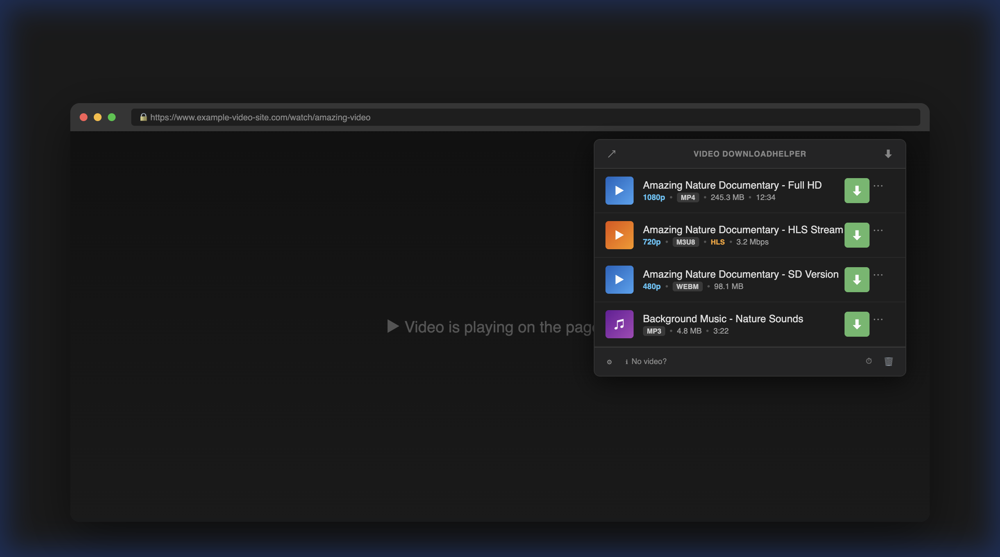
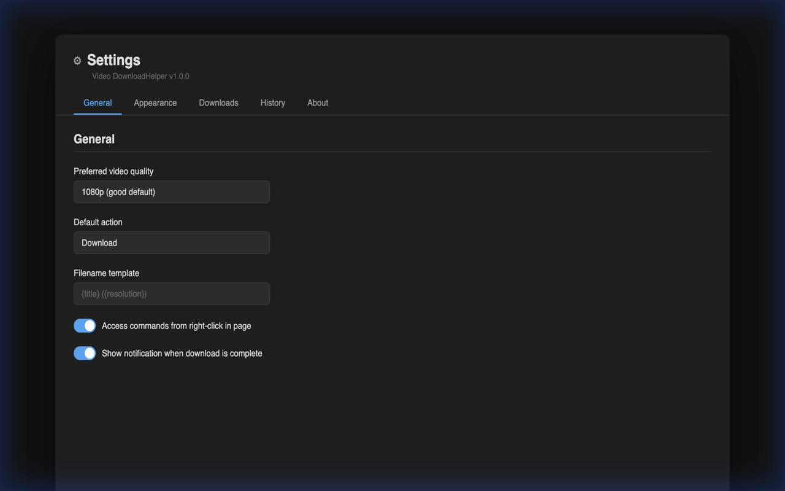
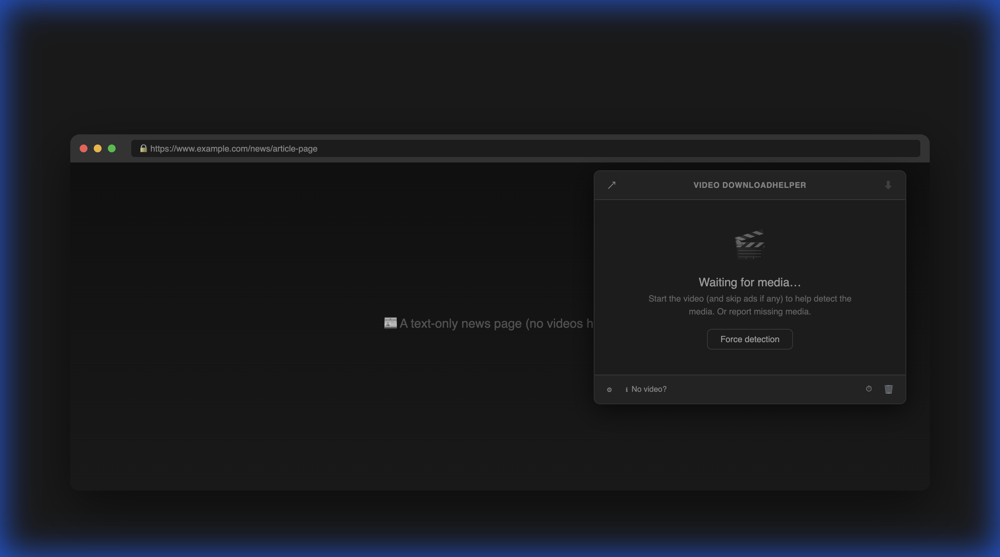

# 🎬 Video DownloadHelper 2.0

### Download any video from any website — fast, easy, and reliable.

---

⚡ **Powered by [MiConvert.com](https://miconvert.com)**

---

## ✨ About

**Video DownloadHelper 2.0** is a powerful browser extension that automatically detects and downloads videos from virtually any website. Built with **Manifest V3** for modern browsers, it supports **1000+ websites**, HLS/DASH streams, and provides a premium dark-themed UI.

> 🔒 **This is a preview repo. Core source code is private.**  
> Interested in the full source? See [💰 Buy Source Code](#-buy-source-code) below.

---

## 🚀 Key Features

| Feature | Description |
|---------|-------------|
| 🔍 **Smart Detection** | Auto-detect videos via network monitoring + DOM scanning |
| 📡 **HLS / DASH Streams** | Record live streams and adaptive bitrate videos |
| 🎬 **4K / 8K Support** | Download in the highest quality available |
| 🎵 **Audio Extraction** | Extract MP3 audio from any video |
| 📁 **Smart Filenames** | Auto-generated from title, resolution, format |
| ⚡ **Fast Downloads** | Native browser download engine, max speed |
| 🌙 **Dark Theme** | Beautiful dark-themed popup & settings UI |
| 🌍 **55 Languages** | Localized for global users |
| 🔒 **Privacy First** | No data collection, no tracking, 100% local |

---

## 📸 Screenshots

| Popup UI | Settings | Empty State |
|----------|----------|-------------|
|  |  |  |

---

## 🏗️ Tech Stack

- **Platform:** Browser Extension (Chrome, Firefox, Edge, Opera)
- **Manifest:** V3
- **Backend:** Service Worker
- **UI:** HTML + CSS + JavaScript
- **Detection:** WebRequest API + DOM MutationObserver
- **Streams:** HLS (m3u8) + DASH (mpd) parser
- **Localization:** 55 Chrome-supported locales

---

## 💰 Buy Source Code

> **Want the complete source code for this extension?**

This repo contains the public-facing assets (UI, icons, locales, store assets). The **core source code** — including background service worker, content scripts, video detection engine, HLS/DASH parser, and utility modules — is available for purchase.

### What's included:

| Component | Files | Lines |
|-----------|-------|-------|
| 🔧 Background Service Worker | `background.js` | ~280 lines |
| 📄 Content Script | `content.js` | ~130 lines |
| 🖥️ Popup Logic | `popup/popup.js` | ~260 lines |
| ⚙️ Settings Logic | `settings/settings.js` | ~140 lines |
| 🔬 URL Parser & Stream Detector | `utils/parser.js` | ~210 lines |
| 📝 Filename Generator | `utils/filename.js` | ~130 lines |
| **Total** | **6 files** | **~1,150 lines** |

### 💲 Price: **$50 USD**

- ✅ Full source code, well-commented
- ✅ Commercial use license
- ✅ Free updates for 6 months
- ✅ Basic setup support via email

📧 Contact: **huuhuybn@gmail.com**

---

## 🛠️ Custom Development / Hire Me

### Need a custom browser extension or web tool?

**I build production-ready extensions for Chrome, Firefox, Edge & Opera.**

### Services:

| Service | Description | Starting At |
|---------|-------------|:-----------:|
| 🧩 **Browser Extension Development** | Custom extensions from scratch | $200 |
| 🔄 **Extension Migration** | Manifest V2 → V3 migration | $100 |
| 🌍 **Localization** | Multi-language support (up to 55 languages) | $50 |
| 🎨 **UI/UX Design** | Modern dark/light theme design | $80 |
| 🛒 **Store Submission** | Publish to Chrome/Firefox/Edge stores | $30 |
| 📦 **Full Package** | Extension + store assets + submission | $300 |

### My Portfolio:

| Project | Description |
|---------|-------------|
| 🎬 **Video DownloadHelper 2.0** | Video downloader extension (this project) |
| 🔄 **[MiConvert](https://miconvert.com)** | File converter platform — web + extension |
| 🖼️ **MiConvert Image Tools** | Image conversion & optimization VS Code extension |
| 📦 **File Compressor** | Browser extension for file compression |

---

## 📖 Wiki & Documentation

Visit the **[Wiki](../../wiki)** for full documentation:

- [🏠 Home](../../wiki/Home) — Introduction & quick start
- [⭐ Premium](../../wiki/Premium) — Lifetime license ($20)
- [🎬 Features](../../wiki/Features) — Full feature list
- [🔧 Installation](../../wiki/Installation) — Setup guide
- [🆘 Support](../../wiki/Support) — Help & troubleshooting
- [💝 Donate](../../wiki/Donate) — Support development
- [❓ FAQ](../../wiki/FAQ) — Common questions

---

## 🌍 Supported Languages

55 languages supported (click to expand)

| Language | Code | Language | Code |
|----------|------|----------|------|
| Amharic | am | Malayalam | ml |
| Arabic | ar | Marathi | mr |
| Bengali | bn | Malay | ms |
| Bulgarian | bg | Dutch | nl |
| Catalan | ca | Norwegian | no |
| Czech | cs | Polish | pl |
| Danish | da | Portuguese (BR) | pt_BR |
| German | de | Portuguese (PT) | pt_PT |
| Greek | el | Romanian | ro |
| English | en | Russian | ru |
| English (GB) | en_GB | Slovak | sk |
| English (US) | en_US | Slovenian | sl |
| Spanish | es | Serbian | sr |
| Spanish (LatAm) | es_419 | Swedish | sv |
| Estonian | et | Swahili | sw |
| Persian | fa | Tamil | ta |
| Finnish | fi | Telugu | te |
| Filipino | fil | Thai | th |
| French | fr | Turkish | tr |
| Gujarati | gu | Ukrainian | uk |
| Hebrew | he | Urdu | ur |
| Hindi | hi | Vietnamese | vi |
| Croatian | hr | Chinese (Simplified) | zh_CN |
| Hungarian | hu | Chinese (Traditional) | zh_TW |
| Indonesian | id | Kannada | kn |
| Italian | it | Korean | ko |
| Japanese | ja | Latvian | lv |
| Lithuanian | lt | | |

---

## ⚡ Powered by [MiConvert.com](https://miconvert.com)

**MiConvert** — Your all-in-one file conversion platform

🌐 [miconvert.com](https://miconvert.com) · 📧 [huuhuybn@gmail.com](mailto:huuhuybn@gmail.com) · 💰 [PayPal](https://paypal.me/parduota)

---

**© 2024-2026 MiConvert. All rights reserved.**

